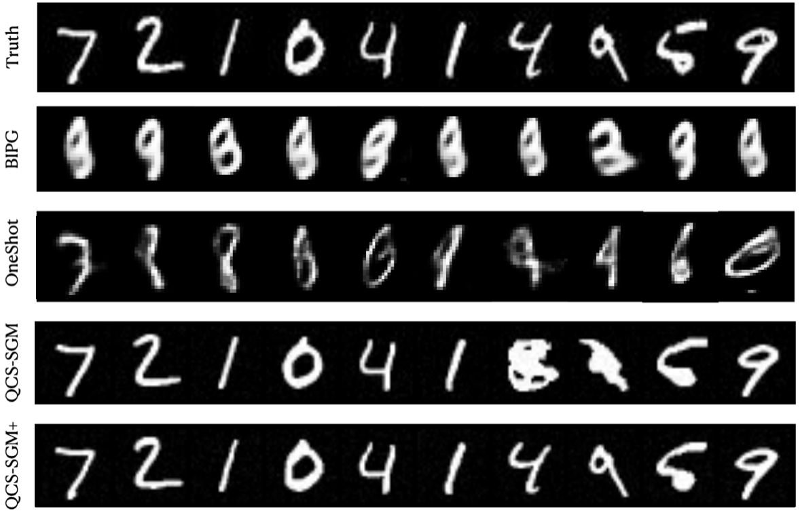
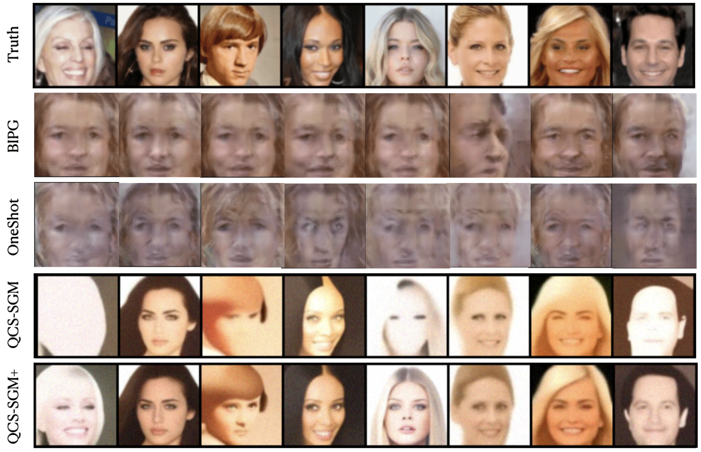

# QCS-SGM+: Improved Quantized Compressed Sensing with Score-Based Generative Models

This repo shows code of an advanced variant of [QCS-SGM](https://arxiv.org/abs/2211.13006), namely QCS-SGM+. 

[QCS-SGM+: Improved Quantized Compressed Sensing with Score-Based Generative Models](https://arxiv.org/abs/2302.00919v2)

-----------------------------------------------------------------------------------------
<div align="center">
  
  
</div>

A comparison of QCS-SGM+ with QCS-SGM and other algorithms on MNIST and CelebA datasets in the case of 1-bit CS for ill-conditioned sensing matrix A. 

-----------------------------------------------------------------------------------------

## Running Experiments

### Dependencies

Create a new environment and run the following to install all necessary python packages for our code.

```bash
pip install -r requirements.txt
```

### Project structure

main.py` is the file that you should run for quantized CS. Execute ```python main.py --help``` to get its usage description:

```
usage: main.py [-h] --config CONFIG [--seed SEED] [--exp EXP] --model_dir DIR
               [--comment COMMENT] [--verbose VERBOSE] [--test] [--sample]
               [--fast_fid] [--resume_training] [-i IMAGE_FOLDER] [--ni]

optional arguments:
  -h, --help            show this help message and exit
  --config CONFIG       Path to the config file
  --seed SEED           Random seed
  --exp EXP             Path for saving running related data.
  --model_dir DIR       Path for putting the checkpoint file.
  --comment COMMENT     A string for experiment comment
  --verbose VERBOSE     Verbose level: info | debug | warning | critical
  --test                Whether to test the model
  --sample              Whether to produce samples from the model
  --fast_fid            Whether to do fast fid test
  --resume_training     Whether to resume training
  -i IMAGE_FOLDER, --image_folder IMAGE_FOLDER
                        The folder name of samples (saved results)
  --ni                  No interaction. Suitable for Slurm Job launcher
```

Configuration files are in `config/`. You don't need to include the prefix `config/` when specifying  `--config` . All files generated when running the code is under the directory specified by `--exp`. They are structured as:

```bash
<exp> # a folder named by the argument `--exp` given to main.py
├── datasets # all dataset files
├── logs # contains checkpoints and samples produced during training
│   └── <model_dir> # a folder named by the argument `--model_dir` specified to main.py
│      ├── checkpoint_x.pth # the checkpoint file saved at the x-th training iteration
├── saved_results # contains original/recovered images
│   └── DATA_Type # Name of datasets, e.g., MNIST, CIFAR10, CELEBA
│       └── 1-bit # recovered images from 1-bit CS       
```       └── image_x.png # samples generated from checkpoint_x.pth 
│       └── 2-bit # recovered images from 2-bit CS         
```       └── image_x.png # samples generated from checkpoint_x.pth
│       └── 3-bit # recovered images from 3-bit CS        
```       └── image_x.png # samples generated from checkpoint_x.pth
│       └── linear # recovered images from linear (un-quantized) CS        
```       └── image_x.png # samples generated from checkpoint_x.pth
```


### Getting Started 
To reconstruct images from the Q-bit quantized noisy measurements using NCSNv2, one can run the code as follows:
(Take CelebA dataset for an example)

Step 1: 
Edit `celeba_ill_1bit.yml` in ./configs/ to specify the simulated setting, e.g.,

In the sampling group of `**.yml`
    checkpoint id:  `ckpt_id` 
    learning rate:  `step_lr`
    whether the CS problem is considered:  `linear_inverse`  (True or False, set true for CS)
    True: perform conditional sampling based on observations y
    False: perform unconditional sampling 

In the measurements group:
Number of measurements M : `measure_size` 
additive noise variance sigma^2 : `noise_variance`  
Whether or not quantization is used: `quantization`  (True or False)
Number of quantization bits Q: `quantize_bits`
matrix: `type of sensing matrix A `  (eg., 'correlated','ill-conditioned','Gaussian')


Step 2: 
Run the following command 
```shell
python python main.py  --config celeba.yml --model_dir celeba --i ./celeba_results
```
Reconstructed  will be saved in `<exp>/celeba_results/`.


## Pretrained Checkpoints

Please download the existing open-sourced pretrained checkpoints from the following link for MNIST, Cifar10, CelebA, and put them in the 
./exp/logs/mnist, ./exp/logs/cifar10, ./exp/logs/celeba, respectively (Or, you can simply download the whole exp.zip file, unzip it in the root folder of this project). Please select the pre-trained models with the specified `ckpt_id`  in the  config files
MNIST Link: https://1drv.ms/u/s!AksoPUl-6AQRhOceyE4DTvfCTd7b3Q?e=zrJYoi
Link: https://drive.google.com/drive/folders/1217uhIvLg9ZrYNKOR3XTRFSurt4miQrd?usp=sharing

It assumes the `--exp`   argument is set to `exp`


## References

This repo is built on top of the open-sourced QCS-SGM code https://github.com/mengxiangming/QCS-SGM and ncsnv2 code: https://github.com/ermongroup/ncsnv2

```shell

@article{meng2022quantized,
  title={Quantized Compressed Sensing with Score-Based Generative Models},
  author={Meng, Xiangming and Kabashima, Yoshiyuki},
  journal={arXiv preprint arXiv:2211.13006},
  year={2022}
}

@inproceedings{song2020improved,
  author    = {Yang Song and Stefano Ermon},
  editor    = {Hugo Larochelle and
               Marc'Aurelio Ranzato and
               Raia Hadsell and
               Maria{-}Florina Balcan and
               Hsuan{-}Tien Lin},
  title     = {Improved Techniques for Training Score-Based Generative Models},
  booktitle = {Advances in Neural Information Processing Systems 33: Annual Conference
               on Neural Information Processing Systems 2020, NeurIPS 2020, December
               6-12, 2020, virtual},
  year      = {2020}
}
```
